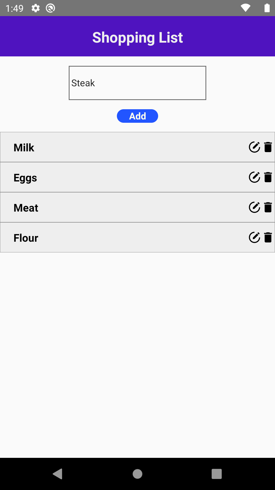
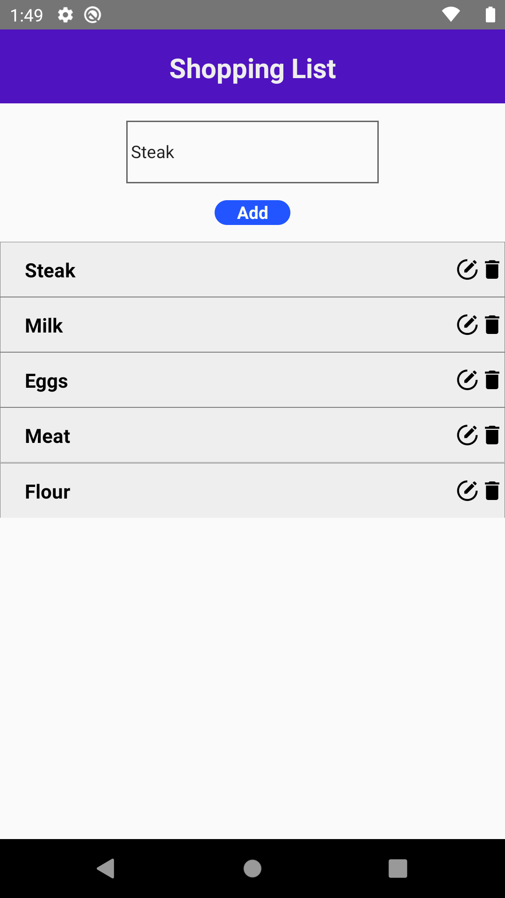
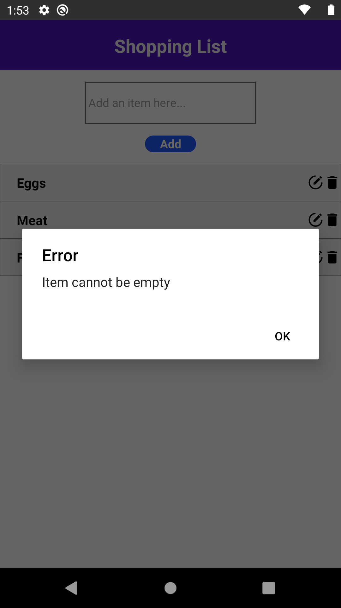
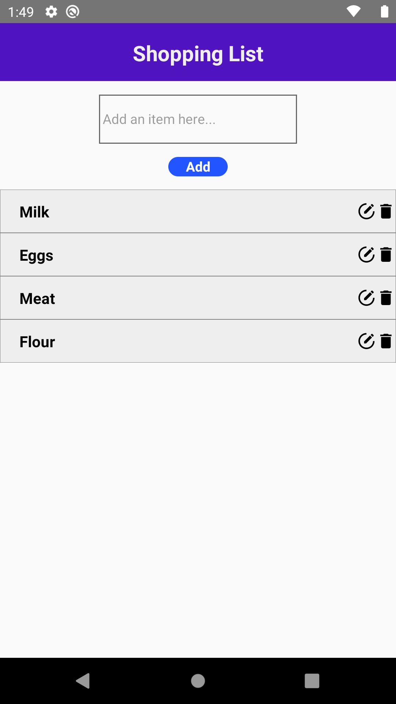
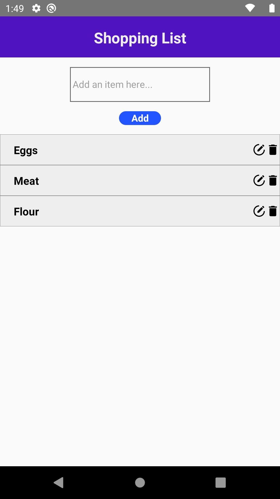

# Shopping List

A small project for learning React Native

To run the project on your computer

```
npm install
```

```
$ react-native start
$ react-native run-android
```

## Adding an item:

1. First type the name of the item you want to add.
   

2. Then click on the Add button

3. The new item should be added and appear in the list
   

4. If the text field is empty, an error prompt would be shown
   

## Deleting an item

1. Beside the item you want to delete, click the delete icon
   
2. After clicking the button, the item will no longer appear in the list
   
